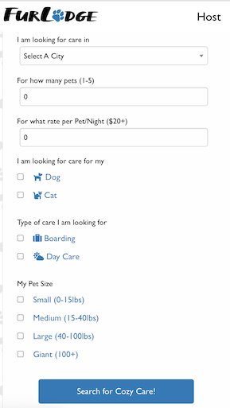
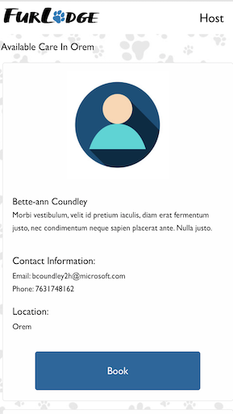
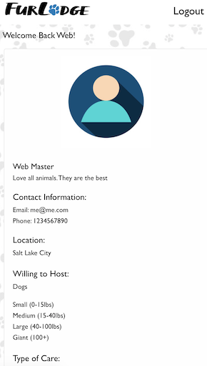
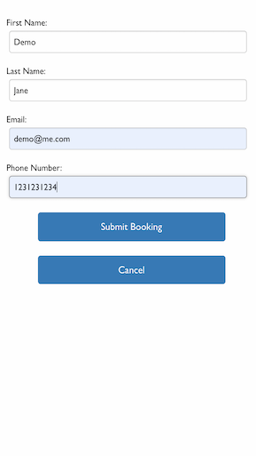
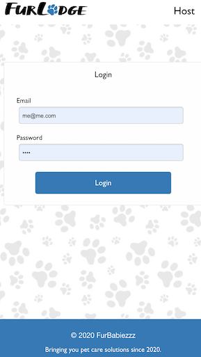

# FUR LODGE 
## -- An APP To Find A Loving Host For Our FURRRRIENDS

 ## Project Objective
  * To create an Airbnb-like pet boarding marketplace connecting pet owners with people(hosts) who are willing to take care of the pets while their owners are away. Find our beloved furriends a real home to stay and play when we are away. 
  * It uses express-handlebars, Foundation CSS framework and jQuery lirary for the front-end.
  * It utilizes node.js, express.js, express-session, bcryptjs, passport, passport-local strategy, sequelize, mysql2 for the back-end. 
  * It features a mobile-first, a clean and polished user interface and adapts to multiple screen sizes.
  * It applies ARIA accessibility rules and guidelines
  
  ## User Story
  AS A dog-owner, I WANT to find someone or a family who loves dogs as much as me and is willing to take care of my dogs as needed while making money, SO THAT I can focus on my trip with less worries about my dogs. I WANT to see the available hosts who meet my criteria such as budget, care types, number of pets willing to host in my specified city without having to sign up for an account; I WANT to see the host contact and book it directly on the application. 


  ## Technologies 
  ```
  node.js, npm, express.js, express-session, bcryptjs, passport, passport-local strategy,
  ```
   ```
 sequelize, mysql2, express-handlebars, Foundation CSS framework, jQuery and heroku. 
  ```
<hr>


  

  ## Screenshots-Demo
  <kbd></kbd>
  <kbd></kbd>
  <kbd></kbd>
  <kbd></kbd>
  <kbd></kbd>
  <kbd></kbd>
  <kbd></kbd>
  
 
